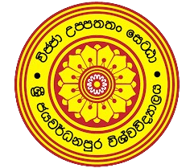
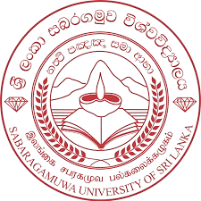
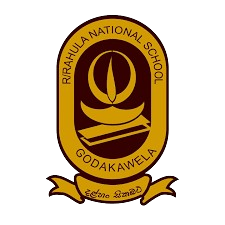

# EDUCATION

## University of Sri Jayewardenepura (Mar 2020 - Dec 2023)

**BSc(Special) in information and communication technology , Computer Software Engineering, Software Quality Assurance ,CybersecurityBSc(Special) in information and communication technology , Computer Software Engineering, Software Quality Assurance ,Cybersecurity**

**Grade**: 3.21 (Second Class Lower Division)

**Skills:** Mobile Applications · User Interface Design · MERN Stack · Software Development Life Cycle (SDLC) · Arduino · MERN Stack · Web Development · Software Development Life Cycle (SDLC) · React.js · Research Skills · Arduino · Software Development Life Cycle (SDLC) · Internet of Things (IoT). · Object-Oriented Programming (OOP) · Software Development Life Cycle (SDLC).SQL · Music Technology · Python (Programming Language) · Software Development Life Cycle (SDLC)

<figure><figcaption>
university of sri jayewardenepura
</figcaption></figure>

## Sabaragamuwa University of Sri Lanka (Sep 2018 - Mar 2019)

**Certificate Course in English**

**Grade**: 2.32

**Skills:** Reading · Writing · Speech · Project writing · Listening

<figure><figcaption>
sabaragamuwa university of sri lanka
</figcaption></figure>

## Sivali central college- Rathnapura(2016-2018)

**Art stream**

Advanced Level Performance: Art Stream (Z-Score: 1.6900)

* Geography - A&#x20;
* Music -A&#x20;
* ICT - C

<figure><figcaption>
Sivali Central College
</figcaption></figure>

## Rahula National School - Godakawela(2004 - 2015)

**General Studies**

Ordinary Level Performance : 7A & 2C

<figure><figcaption>
Rahula National School
</figcaption></figure>
