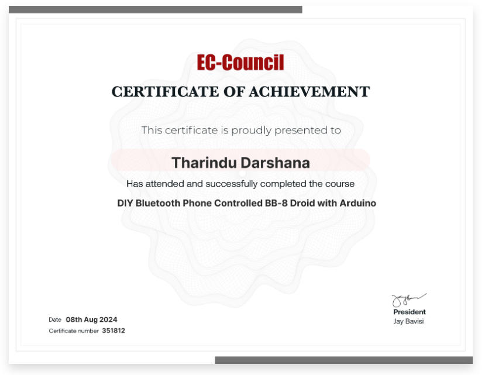

# EC-Council

## Cisco LABS Crash Course

<figure><figcaption>
<strong>Cisco LABS Crash Course</strong> Certificate
</figcaption></figure>



## DIY Bluetooth Phone Controlled BB-8 Droid with Arduino

<figure><figcaption>
DIY Bluetooth Phone Controlled BB-8 Droid with Arduino <strong>Course</strong> Certificate 
</figcaption></figure>



## Introduction to Dark Web, Anonymity, and Cryptocurrency

<figure><figcaption>
<strong>Introduction to Dark Web, Anonymity, and Cryptocurrency Course</strong> Certificate
</figcaption></figure>


