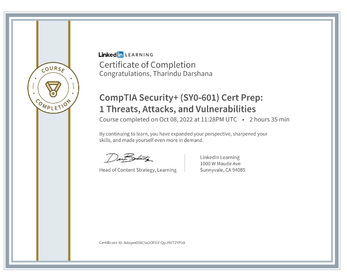
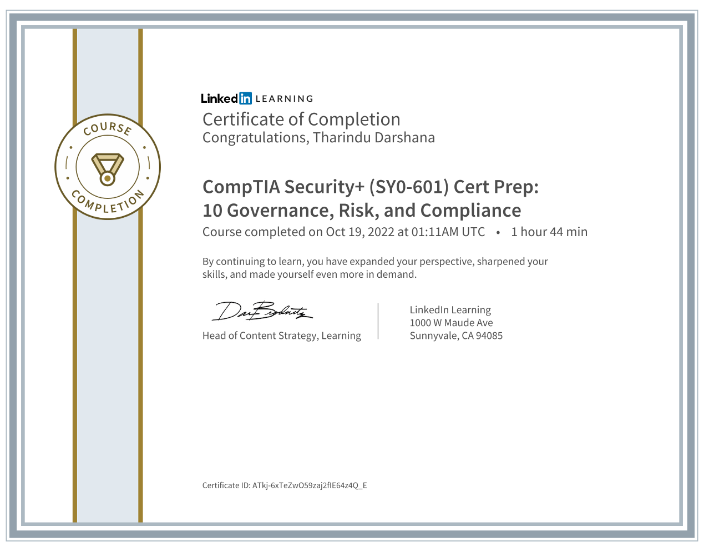
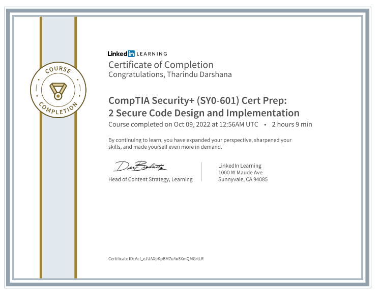
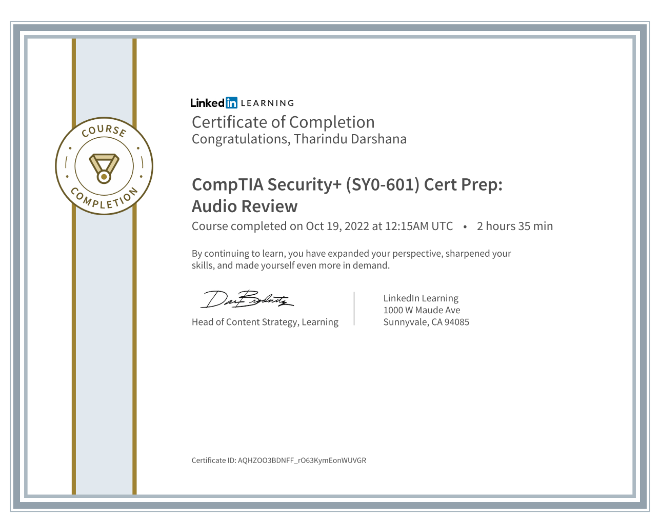
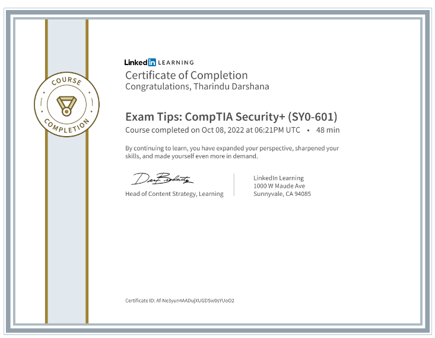
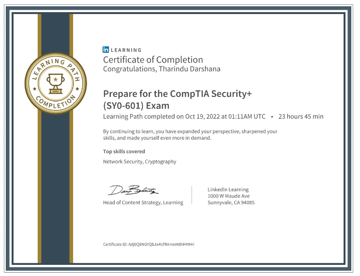

# LinkedIn

## CompTIA Security+ (SY0-601) Cert Prep: 1 Threats, Attacks, and Vulnerabilities

<figure><figcaption>
Threat &#x26; Vulnerability Management Course Certificate
</figcaption></figure>



## CompTIA Security+ (SY0-601) Cert Prep: 10 Governance, Risk, and Compliance

<figure><figcaption>
 Governance, Risk, and ComplianceLinkedIn Course Certificate
</figcaption></figure>



## CompTIA Security+ (SY0-601) Cert Prep: 2 Secure Code Design and Implementation

<figure><figcaption>
Cert Prep: 2 Secure Code Design and Implementation Course Certificate
</figcaption></figure>



## CompTIA Security+ (SY0-601) Cert Prep: Audio Review

<figure><figcaption>
CompTIA Security+ (SY0-601) Cert Prep: Audio Review
</figcaption></figure>



## Exam Tips: CompTIA Security+ (SY0-601)

<figure><figcaption>
CompTIA Security+ (SY0-601) Exam Tips
</figcaption></figure>



## Prepare for the CompTIA Security+ (SY0-601) Certification Exam

<figure><figcaption></figcaption></figure>


